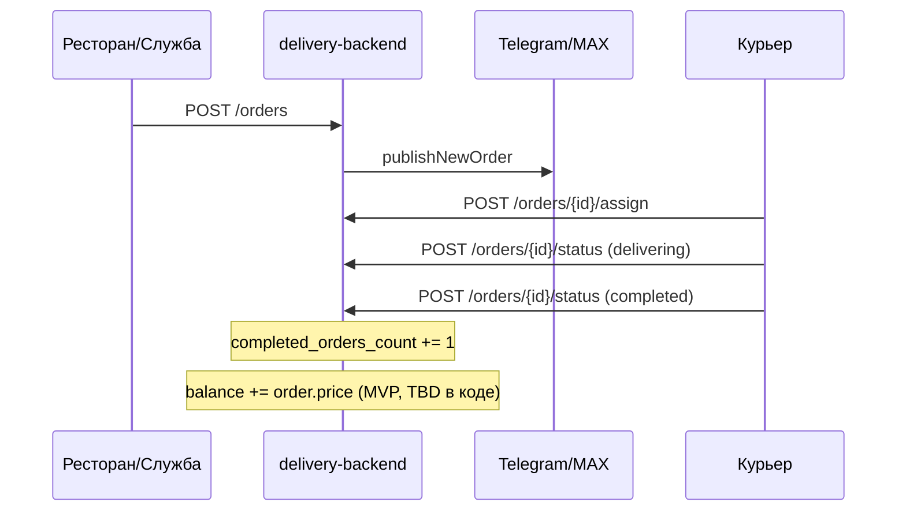
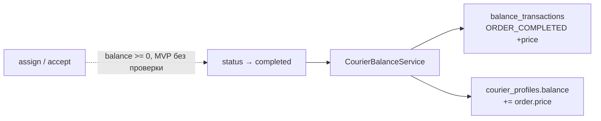
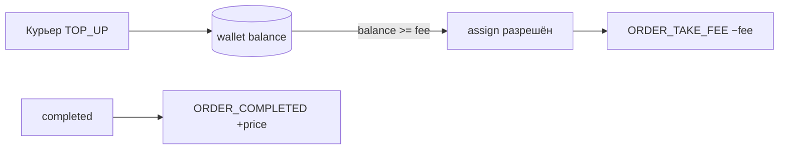

# Спецификация miniapp-delivery

> **Статус:** снимок кодовой базы на 2026-06-10. Описывает реализованное и заложенные, но не доделанные части. Рабочий документ для доработок.

---

## 1. Назначение продукта

Telegram / web Mini App для курьерской доставки еды (и аналогичных заказов). Три роли в UI:

| Роль | Кто | Интерфейс |
|------|-----|-----------|
| **Курьер** | Водитель службы | `/courier/*` |
| **Объект (ресторан)** | Точка, создающая заказы | `/restaurant/*` |
| **Курьерская служба** | Оператор, владеет курьерами и каналами | `/service/*` |

Один пользователь (`miniapp-account`) может состоять в нескольких организациях; активный контекст выбирается через `GET/PATCH /me`.

---

## 2. Архитектура

```
Клиент (delivery-frontend)
    → miniapp-gateway  /api/delivery/**
        → delivery-backend  (порт 9081, StripPrefix=2)
            → PostgreSQL schema `delivery`
            → miniapp-account (JWT, provisioning пользователей)
            → miniapp-notification (уведомления, этап 2+)
            → Telegram / MAX (публикация заказов в каналы)
```

| Компонент | Путь | Назначение |
|-----------|------|------------|
| `delivery-backend` | `miniapp-delivery/delivery-backend` | API, JPA, Liquibase |
| `delivery-frontend` | `miniapp-delivery/delivery-frontend` | React SPA |
| `miniapp-account` | внешний | Аутентификация, JWT, создание учёток |
| `miniapp-gateway` | внешний | Маршрут `/api/delivery/**` → `:9081` |
| `miniapp-notification` | внешний | Персональные уведомления (подключён в docker-compose) |

**Внешний префикс API:** `/api/delivery/...`  
**Внутренний (в backend):** `/me`, `/orders`, `/couriers`, …

Локальный стек: `docker-compose.dev.yml` + `miniapp-deploy/deploy/dev-stack.env`.

---

## 3. Модель организаций и доступа

### 3.1. Типы организаций

| `OrganizationType` | Описание |
|--------------------|----------|
| `courier_service` | Курьерская служба |
| `client_restaurant` | Ресторан / объект доставки |

Ресторан привязан к службе: `organizations.courier_service_id` (FK на службу).

### 3.2. Роли участников (`MemberRole`)

| Роль | Где | Права (кратко) |
|------|-----|----------------|
| `owner` | служба, ресторан | Полный доступ в организации |
| `manager` | служба, ресторан | Управление (заказы, персонал, настройки) |
| `courier` | только служба | Приём и выполнение заказов |

### 3.3. Статусы участника (`MemberStatus`)

- `active` — полный доступ
- `blocked` — заблокирован

### 3.4. Контекст пользователя (`GET /me`)

`MeResponseDto`:
- `userId`, `status` (`UserDeliveryStatus`: ACTIVE / PENDING / BLOCKED / NO_ACCESS)
- `activeOrganizationId`, `interfaceMode` (`courier` | `restaurant` | `service`)
- `deliveryRole`, `accountStatus`
- `memberships[]` — все привязки с типом org, ролью, статусом

`PATCH /me/active-organization` — переключение активной организации.

### 3.5. RBAC (backend)

Центральный сервис: `AccessControlService`, детали заказов: `OrderAccessService`.

- **Служба (staff):** `owner` или `manager` в `courier_service`
- **Ресторан:** `owner` или `manager` в `client_restaurant`
- **Курьер:** `courier` + `active` в службе заказа
- Staff службы может видеть рестораны своей службы через `courier_service_id`

---

## 4. Доменные сущности (schema `delivery`)

### 4.1. Ядро

| Таблица | Entity | Назначение |
|---------|--------|------------|
| `organizations` | `Organization` | Службы и рестораны |
| `organization_members` | `OrganizationMember` | Участники (user_id из account) |
| `courier_profiles` | `CourierProfile` | Баланс и счётчик заказов курьера |
| `pickup_points` | `PickupPoint` | Точки забора у ресторана |
| `publication_channels` | `PublicationChannel` | Telegram/MAX каналы службы |
| `restaurant_channel_bindings` | `RestaurantChannelBinding` | M:N ресторан ↔ каналы |
| `delivery_orders` | `DeliveryOrder` | Заказы |
| `order_channel_posts` | `OrderChannelPost` | Публикации заказа в каналах |
| `balance_transactions` | — | **Таблица без Java-кода** |
| `courier_requests` | `CourierRequest` | Заявки на подключение курьеров |
| `user_delivery_context` | `UserDeliveryContext` | Активная org, роль в UI |

### 4.2. Заказ (`delivery_orders`)

Ключевые поля:
- `public_number` — человекочитаемый номер
- `courier_service_id`, `restaurant_id`, `pickup_point_id`, `channel_id`
- Адреса: pickup / delivery (+ lat/lon, квартира, подъезд)
- `delivery_time`, `price`, `price_source` (`manual`)
- `customer_phone`, `comment`
- `status` — жизненный цикл (см. §5)
- `courier_user_id` — назначенный курьер
- `publication_status` — `pending` | `processing` | `published` | `failed` | …
- `published_at`, `accepted_at`, `completed_at`, `cancelled_at`
- `created_by_user_id`, `created_by_organization_id`

> Поле `price` — **стоимость доставки по заказу** (вводится при создании, `price_source = manual`). В MVP баланс курьера = сумма `price` по выполненным им заказам. Отдельного `courier_fee` в схеме нет.

### 4.3. Курьерский профиль (`courier_profiles`)

| Поле | Тип | Описание |
|------|-----|----------|
| `member_id` | UUID | 1:1 с `organization_members` (role=courier) |
| `balance` | numeric(14,2) | Сумма `price` выполненных заказов (MVP); позже — ещё и кошелёк предоплаты |
| `completed_orders_count` | int | Счётчик завершённых заказов |
| `updated_at` | timestamptz | |

### 4.4. Транзакции баланса (`balance_transactions`) — только схема

| Поле | Тип | Описание |
|------|-----|----------|
| `id` | uuid | PK |
| `courier_member_id` | uuid | FK → organization_members |
| `amount` | numeric(14,2) | Сумма |
| `type` | varchar(64) | **Enum не определён в коде** |
| `reason` | varchar(512)? | Комментарий |
| `order_id` | uuid? | Связь с заказом |
| `created_at` | timestamptz | |

**Нет:** JPA entity, repository, service, API, миграций после создания таблицы.

---

## 5. Заказы: жизненный цикл

### 5.1. Статусы (`OrderStatus`)

```
waiting_for_courier
    → courier_heading_to_pickup  (при assign/accept)
    → courier_delivering
    → completed

На любом этапе до completed: → cancelled (служба/ресторан)
```

Курьер **не может** отменять заказ; может только:
- `courier_heading_to_pickup` → `courier_delivering`
- `courier_delivering` → `completed`

### 5.2. Основные операции

| Действие | Endpoint | Кто |
|----------|----------|-----|
| Создать | `POST /orders` | Ресторан / служба |
| Список | `GET /orders?scope=...` | По роли и scope |
| Детали | `GET /orders/{id}` | Участники заказа |
| Редактировать | `PATCH /orders/{id}` | До назначения курьера |
| Отменить | `POST /orders/{id}/cancel` | Служба / ресторан |
| Назначить | `POST /orders/{id}/assign` | Курьер (только себя) |
| Сменить статус | `POST /orders/{id}/status` | Курьер / служба |
| Переопубликовать | `POST /orders/{id}/republish` | При сбое публикации |

**Assign:** optimistic lock через `assignOrderIfUnassigned` — защита от гонки при одновременном принятии.

**При `completed`:**
- `completed_at` = now
- `courier_profiles.completed_orders_count` += 1
- **MVP (по спеке):** `balance` += `order.price` — см. §6 (в коде пока не реализовано)

### 5.3. Scopes списка заказов

| scope | Кто видит |
|-------|-----------|
| `courier` / `courier_free` / `free` | Свободные заказы службы курьера |
| `courier_mine` / `mine` | Заказы, назначенные на курьера |
| `restaurant` | Заказы ресторана |
| `service` | Все заказы службы |

### 5.4. Публикация в каналы

После создания заказа → `OrderCreatedEvent` → async публикация в Telegram/MAX каналы, привязанные к ресторану.

- `OrderPublicationService` — отправка, `order_channel_posts` — трекинг
- `publication_status` на заказе
- SSE: `OrderEventsController` — realtime обновления публикации и назначения
- Republish при частичных сбоях

Курьеры видят свободные заказы в каналах и в приложении; принимают через assign.

---

## 6. Баланс курьера

### 6.1. Смысл баланса по этапам

| Этап | Что такое баланс | Зачем |
|------|------------------|-------|
| **MVP** | Накопительная **сумма стоимости доставки** (`order.price`) по заказам, которые курьер довёл до `completed` | Статистика / учёт объёма выполненных доставок |
| **Будущее** | **Предоплаченный счёт** в нашей системе: курьер пополняет баланс, без достаточного остатка **не может взять** заказ | Монетизация, контроль доступа к заказам |
| **Позже** | Партнёрская программа | Отдельная проработка |

> В MVP баланс **не блокирует** работу. В будущем то же поле (или связанный кошелёк) станет условием для `assign` — это нужно учесть в модели данных заранее (ledger транзакций).

### 6.2. MVP: что именно суммируем

**Формула:**

```
balance = SUM(order.price)
  WHERE order.status = completed
    AND order.courier_user_id = <user курьера>
    AND заказ относится к службе курьера (courier_service_id)
```

**Источник суммы:** поле `delivery_orders.price` на момент перехода в `completed` (если цену меняли до назначения курьера — в зачёт идёт актуальное значение в момент завершения).

**Что входит в сумму:**

| Входит | Не входит |
|--------|-----------|
| Заказ в статусе `completed`, назначенный на этого курьера | `cancelled` — даже если курьер уже был назначен |
| Полная `price` заказа (стоимость доставки по заказу) | Заказы без назначенного курьера (`courier_user_id` null) |
| Один раз на заказ (идемпотентность по `order_id`) | Повторное начисление при повторном `completed` |

**Когда начислять:** сразу при переходе `courier_delivering` → `completed` (в одной транзакции с обновлением заказа и профиля).

**Минимальный баланс для взятия заказа в MVP:** **0** — курьер может принимать заказы при нулевом балансе. Проверка баланса при `assign` **не делается**.

**Отображение в UI:** «Баланс» = эта накопительная сумма (₽). Подпись в интерфейсе можно уточнить: «Сумма выполненных доставок».

### 6.3. Ledger (рекомендуемая реализация MVP)

Чтобы потом перейти к предоплате без переделки с нуля:

```
При completed:
  1. INSERT balance_transactions
       type = ORDER_COMPLETED
       amount = +order.price
       order_id = order.id
       courier_member_id = <member курьера в службе>
  2. UPDATE courier_profiles.balance += order.price
```

**Идемпотентность:** уникальный индекс `(order_id, type)` где `type = ORDER_COMPLETED` — повторное завершение того же заказа не дублирует начисление.

**Типы транзакций (MVP):**

| type | amount | Когда |
|------|--------|-------|
| `ORDER_COMPLETED` | +`order.price` | Заказ завершён курьером |

Типы на будущее (не в MVP): `TOP_UP`, `ORDER_TAKE_FEE`, `PARTNER_REWARD`, `ADJUSTMENT`.

### 6.4. Граничные случаи

| Ситуация | Поведение MVP |
|----------|----------------|
| Заказ отменён до `completed` | В баланс не попадает |
| Заказ отменён после `completed` | В MVP откат **не делаем** (редкий кейс; при необходимости — `ADJUSTMENT` вручную) |
| `price` изменили через `PATCH` до assign | При завершении берётся текущая `price` |
| Курьер заблокирован (`MemberStatus.blocked`) | Assign уже запрещён; баланс не меняется |
| Пересчёт «с нуля» | `balance` = SUM транзакций `ORDER_COMPLETED` (сверка с денормализованным полем) |

### 6.5. Будущее (не MVP)

**Предоплата для взятия заказа:**
- Курьер пополняет баланс (`TOP_UP`) — способ пополнения TBD (платёжка / менеджер службы).
- При `assign` проверка: `balance >= fee` (фикс или % от `order.price` — TBD).
- Списание при взятии: транзакция `ORDER_TAKE_FEE` с `amount < 0`.
- Семантика поля сменится: баланс = **остаток на счёте**, а не только накопленная сумма доставок. Возможные варианты:
  - разделить поля: `earnings_total` (как сейчас в MVP) + `wallet_balance` (предоплата);
  - или один ledger, где `ORDER_COMPLETED` и `TOP_UP` / `ORDER_TAKE_FEE` живут в одной цепочке.

**Партнёрская программа:** отдельное обсуждение; в ledger зарезервировать тип `PARTNER_REWARD` / отдельную таблицу.

### 6.6. Текущее состояние в коде (as-is)

| Что | Статус |
|-----|--------|
| `courier_profiles.balance` в БД | ✅ |
| `balance_transactions` в БД | ✅ таблица, без Java |
| Инициализация balance = 0 | ✅ |
| Отображение в UI | ✅ |
| Начисление `price` при `completed` | ❌ **нужно реализовать по §6.2–6.3** |
| Проверка баланса при assign | ❌ не нужна в MVP |
| История транзакций в UI | ❌ |

**Где в коде сейчас:**
- `OrderService.incrementCompletedOrdersCount()` — только счётчик заказов, balance не трогает
- `CourierProfilePage.jsx`, `ServiceCouriersPage.jsx` — показывают `balance` из `GET /couriers/{id}`

### 6.7. MVP — чеклист реализации

- [ ] Entity `BalanceTransaction` + repository
- [ ] `CourierBalanceService.accrueOnOrderCompleted(order)` из `OrderService.applyStatusChange`
- [ ] Уникальность начисления по `order_id`
- [ ] (Опционально) `GET /couriers/{memberId}/transactions` для истории
- [ ] UI: подпись «Сумма выполненных доставок» (по желанию)

---

## 7. Курьеры

### 7.1. Создание

`POST /couriers` — два flow:
- **Provisioning:** ФИО + телефон + email → создание учётки в account + membership + courier_profile
- **Legacy:** существующий `userId`

### 7.2. Управление

| Endpoint | Действие |
|----------|----------|
| `GET /couriers?courierServiceId=` | Список |
| `GET /couriers/{memberId}` | Профиль + balance |
| `PATCH /couriers/{memberId}` | status, displayName |
| `POST /couriers/{memberId}/reset-access` | Сброс пароля через account |

### 7.3. Заявки курьеров (`courier_requests`)

Публичные (без JWT):
- `POST /public/courier-requests` — подача заявки (веб / мессенджер)
- `GET /public/courier-requests/messenger-status` — статус по provider + externalId

Для службы:
- `GET /courier-requests?courierServiceId=`
- `POST /courier-requests/{id}/approve` / `reject`

Статусы: `NEW` → `APPROVED` | `REJECTED`. При approve — provisioning курьера в службу.

---

## 8. Рестораны, точки, каналы

### 8.1. Рестораны

| Endpoint | Описание |
|----------|----------|
| `POST /restaurants` | Создать (привязка к службе) |
| `GET /restaurants` | Список доступных |
| `PATCH /restaurants/{id}` | Обновить |

### 8.2. Точки забора

| Endpoint | Описание |
|----------|----------|
| `GET/POST /restaurants/{id}/pickup-points` | CRUD точек |
| `PATCH/DELETE /pickup-points/{id}` | |

### 8.3. Каналы публикации

| Endpoint | Описание |
|----------|----------|
| `GET/POST /channels?courierServiceId=` | Каналы службы (Telegram/MAX) |
| `PATCH/DELETE /channels/{id}` | |
| `GET/PUT /restaurants/{id}/channels` | Привязка каналов к ресторану |

---

## 9. API — сводная таблица

Префикс снаружи: `/api/delivery`

| Группа | Пути |
|--------|------|
| Health | `GET /health` |
| Me | `GET /me`, `PATCH /me/active-organization` |
| Organizations | `/organizations`, `/organizations/{id}/members` |
| Restaurants | `/restaurants`, `/restaurants/{id}/pickup-points`, `/restaurants/{id}/channels` |
| Couriers | `/couriers`, `/couriers/{memberId}` |
| Courier requests | `/courier-requests`, `/public/courier-requests` |
| Channels | `/channels` |
| Pickup points | `/pickup-points/{id}` |
| Orders | `/orders`, `/orders/{id}`, actions |
| Events (SSE) | `/orders/events` (stream) |

---

## 10. Frontend

### 10.1. Маршруты

**Курьер** (`/courier/*`):
- `/orders` — свободные заказы
- `/orders/:id` — детали + принять
- `/my-orders` — мои активные
- `/my-orders/:id` — смена статуса
- `/profile` — профиль, **баланс**, статистика
- `/map` — заглушка

**Ресторан** (`/restaurant/*`):
- Заказы, создание, точки забора, каналы, сотрудники, профиль

**Служба** (`/service/*`):
- Заказы, объекты (рестораны), **курьеры (с балансом)**, каналы, профиль
- Dev: `/service/admin`

**Общее:**
- `/login`, `/messenger/link`, `/select-organization`, `/no-access`

### 10.2. Авторизация

- JWT от `miniapp-account` (телефон, email, мессенджер)
- `AuthContext` — memberships, active org, interface mode
- Маршрутизация по `interfaceMode` после логина

### 10.3. Realtime

- `useOrderPublicationSse` — статус публикации заказа
- События назначения курьера

---

## 11. Интеграции

| Сервис | Назначение |
|--------|------------|
| `miniapp-account` | JWT validation, `AccountProvisioningClient`, `AccountUserClient` |
| `miniapp-notification` | Уведомления (курьеру при assign и др.) |
| Telegram Bot API | Публикация заказов в каналы |
| MAX Bot | Альтернативная платформа каналов |

Внутренний ключ: `MINAPP_INTERNAL_MONOLITH_KEY` для service-to-service вызовов.

---

## 12. Миграции БД

| Файл | Содержание |
|------|------------|
| `001-foundation.yaml` | Schema, orgs, members, courier_profiles, orders, channels, **balance_transactions** |
| `002-organization-courier-service-link` | courier_service_id на ресторанах |
| `003`–`008` | pickup, channels, order statuses, адреса |
| `009`–`011` | courier applications → courier_requests |
| `012`–`014` | created_by_organization, publication_status, email в заявках |

---

## 13. Этапы разработки (из ARCHITECTURE.md)

| Этап | Содержание | Статус |
|------|------------|--------|
| 1 | Foundation, schema, JWT | ✅ |
| 2 | Organizations, members, RBAC, `/me` | ✅ |
| 3 | Pickup points, channels, restaurant bindings | ✅ |
| 4 | Orders, publish, accept | ✅ (без баланса) |
| — | **Баланс курьера** (сумма `price` по completed) | 📋 Спека готова, код ❌ |
| — | Предоплата / fee при assign | 🔜 после MVP |
| — | Карта заказов для курьера | ❌ UI-заглушка |
| — | Notification center в delivery UI | 🔜 этап 2+ |

---

## 14. Диаграммы

### 14.1. Поток заказа



### 14.2. Баланс MVP



### 14.3. Баланс (будущее: предоплата)



---

## 15. Ключевые файлы

### Backend
- `service/OrderService.java` — заказы, completed_orders_count
- `service/OrderAccessService.java` — права на заказы
- `service/CourierService.java` — CRUD курьеров
- `domain/CourierProfile.java` — balance field
- `service/publication/OrderPublicationService.java`
- `api/*Controller.java`

### Frontend
- `api/deliveryService.js` — HTTP client
- `pages/courier/CourierProfilePage.jsx` — баланс курьера
- `pages/service/ServiceCouriersPage.jsx` — баланс в списке
- `routes/CourierRoutes.jsx`, `ServiceRoutes.jsx`, `RestaurantRoutes.jsx`

### DB
- `db/changelog/changes/001-foundation.yaml` — courier_profiles, balance_transactions

---

## 16. Раздел для дополнения

> Заполнять по мере принятия решений.

### Баланс
- [x] MVP: сумма `order.price` по `completed` заказам курьера
- [x] MVP: assign при balance = 0 разрешён
- [ ] Реализация начисления в backend (§6.7)
- [ ] Будущее: TOP_UP, fee при assign, минимальный остаток
- [ ] Партнёрская программа — отдельно

### Заказы
- [ ] Авто-расчёт `price` (сейчас только manual)
- [ ] Редактирование после assign

### Прочее
- [ ] Карта курьера
- [ ] Push-уведомления о новых заказах

---

*При изменении модели или API — обновлять этот документ.*
